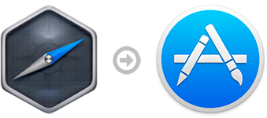

# NW.js Mac App Store Builder



This node module has been made to easily build and publish [NW.js](http://nwjs.io) apps on the Mac App Store.

It automates all the steps described in [Publishing NW.js apps on the Mac App Store: a detailed guide](https://github.com/johansatge/nwjs-macappstore).

---

* [Installation](#installation)
* [Configuration](#configuration)
* [Programmatic usage](#programmatic-usage)
* [CLI usage](#cli-usage)
* [Changelog](#changelog)
* [License](#license)
* [Credits](#credits)

## Installation

Install with [npm](https://www.npmjs.com/):

```bash
npm install nwjs-macappstore-builder
```

## Configuration

The configuration of the tool uses a standard JS object:

```javascript
var config = {

    // Build paths
    nwjs_path: '/Applications/nwjs.app', // Last build tested with NW.js 0.12.2
    source_path: '/Users/johan/Github/my-nwjs-project/app', // App root (the dir with the package.json file)
    build_path: '/Users/johan/Desktop', // Destination dir of the .app build
    
    // App informations
    name: 'Your App',
    bundle_id: 'com.yourcompanyname.yourapp',
    version: '1.4.8',
    bundle_version: '148',
    copyright: '© Sample copyright',
    icon_path: '/Users/johan/Github/my-nwjs-project/icon.icns',
    
    // Signing configuration
    identity: 'LK12345678',
    entitlements: [
      'com.apple.security.network.client',
      'com.apple.security.assets.movies.read-only'
    ],
       
    // App categories
    app_category: 'public.app-category.utilities',
    app_sec_category: 'public.app-category.productivity',
 
    // Additional keys to add in the Info.plist file (optional, remove if not needed)
    plist: {
        NSSampleProperty1: 'Property value 1',
        NSSampleProperty2: {
            NSSub1: 'Sub-property value 1',
            NSSub2: 'Sub-property value 1'
        }
    }
}
```

## Programmatic usage

Just require the module and fire the `build` function.

```javascript
var Builder = require('nwjs-macappstore-builder');
var show_output = true;

builder.build(config, function(error, app_path)
{
    console.log(error ? error.message : 'Build done: ' + app_path);
}, show_output);
```

## CLI usage

Each parameter of the config can be passed as a parameter:

```bash
nwjs-macappstore-builder --name=YourApp --bundle_id=com.yourcompanyname.yourapp [...]
```

As there are a lot of parameters, you may prefer this more readable alternative:

```bash
nwjs-macappstore-builder --config=/Users/johan/Desktop/build-config.json
```

The `build-config.json` file being a JSON object containing all the parameters described above.

## Changelog

| Version | Date | Notes |
| --- | --- | --- |
| `1.0.1` | July 08th, 2015 | Fix missing dependency |
| `1.0.0` | July 08th, 2015 | Initial version |

## License

This project is released under the [MIT License](LICENSE).

## Credits

* [async](https://github.com/caolan/async)
* [colors](https://github.com/Marak/colors.js)
* [plist](https://github.com/TooTallNate/plist.js)
* [validator.js](validatorjs.org)
* [yargs](https://github.com/bcoe/yargs)
